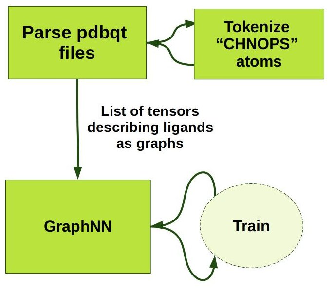
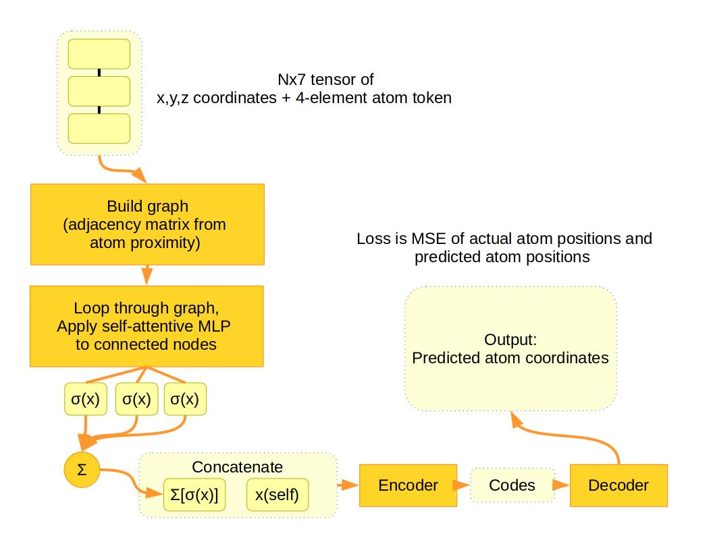

# graphnn

Graph Neural Networks are becoming a dominant architecture for problem domains that natural lend themselves to formulation as a graph. In particular, GNNs are drawing substantial interest for computational chemistry for drug design and development. Before diving into the various GNN libraries that are available I wanted to build one from (almost) scratch as an exercise. 

This is related to my [DockRL](https://github.com/rivesunder/DockRL) project for molecular docking optimization from a reinforcment learning and evolutionary strategies perspective.


## Cartoon Overview

<div align="center">

</div>

Data for this project are pdbqt files, converted from pdb with [openbabel](http://openbabel.org/wiki/Main_Page). These describe molecules as a text file with atom information contained in columns, organized in root and branch chains. 

```
REMARK  Name = 1gpk-hup.pdb
REMARK                            x       y       z     vdW  Elec       q    Type
REMARK                         _______ _______ _______ _____ _____    ______ ____
ROOT
ATOM      1  C   LIG    1        0.726  68.848  60.595  0.00  0.00    +0.268 C 
ATOM      2  C   LIG    1        0.003  68.825  61.859  0.00  0.00    +0.056 C 
ATOM      3  C   LIG    1        0.576  68.272  62.986  0.00  0.00    -0.015 C 
ATOM      4  C   LIG    1        1.908  67.694  62.988  0.00  0.00    +0.073 C 
ATOM      5  C   LIG    1        2.569  67.047  64.283  0.00  0.00    +0.067 C 
ATOM      6  C   LIG    1        3.321  68.130  65.111  0.00  0.00    +0.040 C 
ATOM      7  C   LIG    1        4.765  68.387  64.718  0.00  0.00    -0.046 C 
ATOM      8  C   LIG    1        5.453  69.459  65.536  0.00  0.00    +0.026 C 
ATOM      9  C   LIG    1        5.376  67.694  63.716  0.00  0.00    -0.030 C 
ATOM     10  C   LIG    1        4.657  66.598  62.902  0.00  0.00    +0.046 C 
ATOM     11  C   LIG    1        4.017  67.169  61.560  0.00  0.00    +0.048 C 
ATOM     12  C   LIG    1        3.563  65.967  63.794  0.00  0.00    -0.031 C 
ATOM     13  C   LIG    1        3.463  64.691  64.143  0.00  0.00    -0.033 C 
ATOM     14  C   LIG    1        4.352  63.553  63.742  0.00  0.00    +0.030 C 
ATOM     15  C   LIG    1        2.624  67.723  61.749  0.00  0.00    +0.035 C 
ATOM     16  O   LIG    1        0.265  69.331  59.526  0.00  0.00    -0.268 OA
ATOM     17  N   LIG    1        2.007  68.291  60.614  0.00  0.00    -0.184 NA
ENDROOT
BRANCH   5  18
ATOM     18  N   LIG    1        1.508  66.456  65.146  0.00  0.00    -0.320 NA
ATOM     19  H   LIG    1        0.665  66.329  64.605  0.00  0.00    +0.119 HD
ATOM     20  H   LIG    1        1.321  67.075  65.922  0.00  0.00    +0.119 HD
ENDBRANCH   5  18
TORSDOF 1
```

The first step toward using these molecular data is to parse them into a tensor format that can be interpreted as a graph. I do that with some python string manipulation and store the results into a list of tensors, each element in the list represents a different ligand. Each ligand has a different number of atoms (hence the use of a list to store different ligands) and each ligand tensor has dimensions NxD, where N is the number of nodes in the molecule and D is the length of the vector describing each node (7 currently). 

Atoms belonging to the most common ["CHNOPS"](https://en.wikipedia.org/wiki/CHON) elements are tokenized before adding to the node vector. Currently tokenization is just a matter of building a dictionary for each element with `np.random` and a set seed, but I would expect some improvements from using a learned embedding model to tokenize atoms.

<div align="center">

</div>

Once the ligand data are converted to tensors, they can be fed one at a time to GraphNN, a GNN model subclassed from `torch.nn.Module`. At each forward pass, a graph is first built up based on the distance between atoms, proximal atoms below a cutoff threshold are assumed to be bonded. Graph connections are represented as an [adjacency matrix](https://en.wikipedia.org/wiki/Adjacency_matrix). 

During the forward pass, GraphNN loops through the adjacency matrix and, where connections are present, applies a shared MLP that outputs a tensor divided into key, query, and value vectors. The matrix dot product of key and query vectors for each output are used as raw [attention](https://en.wikipedia.org/wiki/Attention_(machine_learning) values. These attention values are together subjected to a [softmax](https://en.wikipedia.org/wiki/Softmax_function) activation function, ensuring the sum of attention weights will be 1.0. Finally, the sum of the products of attention weights and value vectors are concatenated with the present nodes input vector and this becomes the input to the update network.

The update network can further be divided into encoder and decoder layers, and they yield an output: the predicted coordinates for the atom at each node. Note that to prevent training an overcomplicated identity function, the input data are corrupted sightly with noise and some activations are set to 0 during training using [dropout](http://www.cs.toronto.edu/~rsalakhu/papers/srivastava14a.pdf). 


